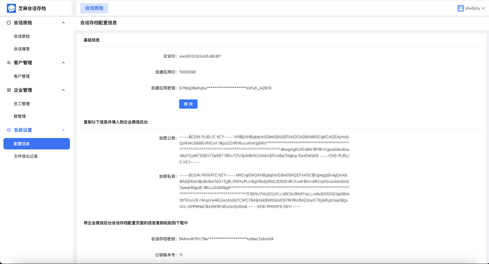
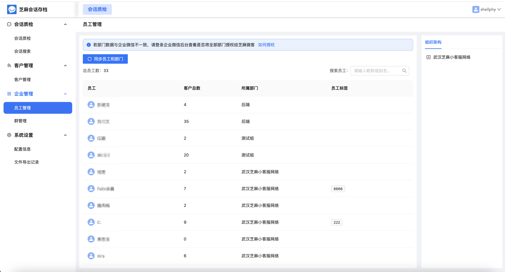
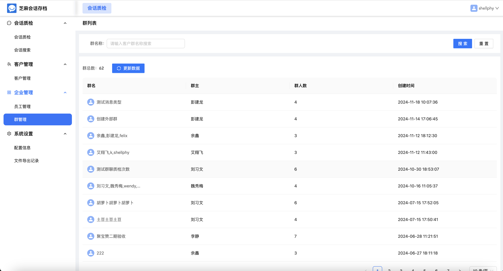
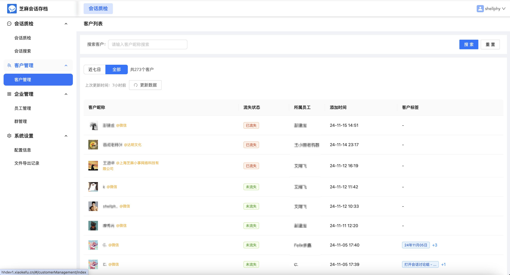
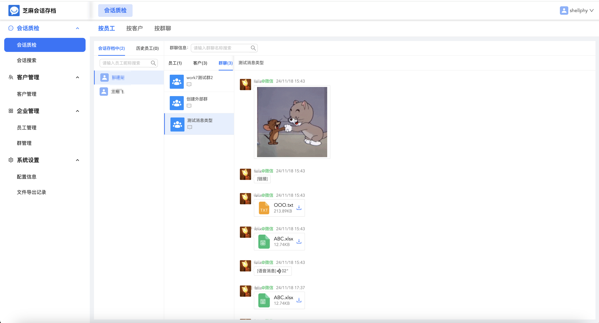
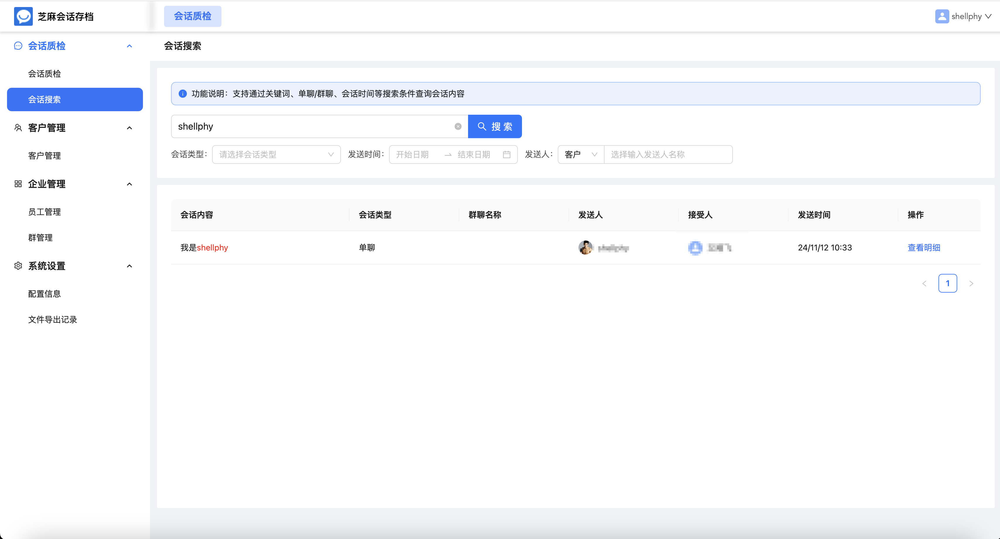

# 芝麻会话存档私有化部署

芝麻会话存档是一款免费开源的私有化部署会话存档解决方案，支持将聊天记录存储在专属的独立环境里，充分满足企业合规需求。

### 芝麻会话存档具有高安全，高隐私，自主可控的特性

1、芝麻会话存档具有高安全，高隐私，自主可控的特性

2、支持一键本地部署，开箱即用

3、数据存储安全性更高，更可控

4、企业自建应用接入，成本更低

### 芝麻会话存档目前支持以下功能

1、文字、图片、文件、短语音、删除、撤回等内容实时存档

2、员工/客户/群聊/等多角度查看

3、自定义设置员工、客户敏感词，触发可即时提醒

4、员工或客户触发后，及时通知，快速响应

5、统计员工单聊，群聊内员工回复效率，响应时间

详细使用和部署文档请参考[官方文档](https://zhimahuihua.com/docs/)

可以参考我们的[演示站](https://demo.zhimahuihua.com)

操作界面预览：

## 联系我们

欢迎联系我们获取帮助，或者提供建议帮助我们改善产品。您可以通过以下方式联系我们：

- **微信：** 使用微信扫码添加客服详细了解

  

- **邮箱：** 您可以发送邮件到jarvis@2bai.com.cn联系我们。

### 协议

---

本仓库遵循[qiweidoc Open Source License](https://github.com/zhimaAi/qiweidoc/blob/main/LICENSE)
开源协议。[qiweidoc Open Source License](https://github.com/zhimaAi/qiweidoc/blob/main/LICENSE)基于Apache License
2.0协议，但是有一些额外的限制，包括：

1、允许作为后台服务商用，但是不可用于多租户SAAS模式。

2、除非您获取特定的商业许可，否则任何形式的商用服务均不可移除qiweidoc页面上的版权信息和qiweidoc logo。

完整协议请查看[qiweidoc Open Source License](https://github.com/zhimaAi/qiweidoc/blob/main/LICENSE)
，需要获取额外的商业许可请[联系我们](#联系我们)

