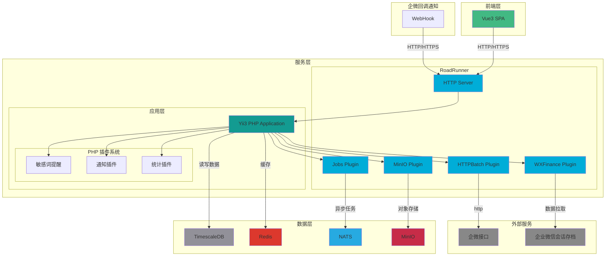

# 技术架构

## 整体架构
本项目采用经典的前后端分离架构，前端基于 Vue3 开发单页面应用，后端采用 PHP + Golang 的混合架构，通过 Docker 实现容器化部署。

## 核心技术栈

### 1. 数据存储

- **主数据库**：TimescaleDB（基于 PostgreSQL）
    - 强大的时序数据处理能力
    - 实时统计视图（Continuous Aggregates） 
      - 支持大规模数据的实时统计分析 
      - 增量更新，计算成本极低 
      - 自动维护统计结果的准确性 
      - 显著提升了复杂统计查询的性能 
    - 继承了 PostgreSQL 的事务特性 
    - 通过自动分区提供出色的查询性能

- **缓存系统**：Redis
    - 提供高速数据缓存
    - 支持多样化的数据结构
    - 显著提升了系统响应速度

- **文件存储**：MinIO
    - 兼容 S3 协议的对象存储服务
    - 支持接入各类云存储作为后端
    - 统一的文件管理接口

### 2. 消息处理

- **消息队列**：NATS
    - 轻量级设计，运行时资源占用极低
    - 支持多种消息模式：Pub/Sub、Queue、Request-Reply
    - 高性能
      - 单机支持数百万 msg/s
      - 端到端延迟 < 100μs
    - 为系统提供可靠的异步处理能力

### 3. 应用服务

- **HTTP 服务器**：Golang + RoadRunner
    - 基于 Go 开发的高性能应用服务器
    - 优秀的并发处理能力
    - 有效管理 PHP 工作进程，防止内存泄漏
    - 插件系统
        - MinIO Plugin: 提供文件存储 RPC 服务
        - Jobs Plugin: 集成 NATS 消息队列，处理异步任务
        - HTTPBatch Plugin: 提供批量 HTTP 请求服务
        - WXFinance Plugin: 企业微信会话存档数据拉取服务
    - 与 PHP 高效通信
        - 基于 Goridge 的高性能 RPC
        - 支持多种数据格式
    - 内置功能
        - 自动 HTTPS 证书管理
        - 优雅重启
        - 状态监控

- **后端框架**：Yii3
    - 基于 php8.2，利用最新特性，更快更稳定
        - 构造器属性提升
        - 命名参数
        - 枚举类型
        - 只读属性
        - 类型声明和联合类型
    - 现代化的 PHP 框架
      - 完全基于 PSR-11 标准的依赖注入和容器
      - 符合 PSR-15 的中间件机制
      - PSR-17 的请求-响应处理
      - PSR-3 的日志接口
      - PSR-16 的缓存接口
    - 模块化设计便于功能扩展
      - 灵活的路由系统
      - 可插拔的插件系统
    - 开发体验
      - 开箱即用的常用功能
      - 详细的错误提示
      - 热重载支持

### 4. 前端技术

- **核心框架**：Vue3
    - 采用 Composition API
    - 配合 Vite 实现快速的开发构建
    - 良好的开发体验和运行性能

## 部署方案

采用 Docker 容器化部署，各服务独立容器运行，通过 Docker Compose 进行服务编排，实现了环境统一和快速部署。

## 技术选型优势

1. **高性能**
    - TimescaleDB 的强大查询性能
    - RoadRunner 的并发处理能力
    - NATS 的轻量级消息处理

2. **易扩展**
    - MinIO 支持对接各类云存储
    - 容器化部署便于横向扩展
    - 模块化的架构设计

3. **低维护成本**
    - Docker 简化了部署和运维
    - 成熟稳定的技术栈
    - 完善的社区支持

## 实际应用效果

- 系统运行稳定，各组件配合良好
    - 服务可用性 > 99.9%
    - 平均响应时间 < 50ms
- 研发效率高，技术栈契合业务需求
    - 支持快速迭代
    - 便于功能扩展
- 性能表现优秀，能够满足当前业务规模
    - 支持每日百万级消息处理
    - 文件存储可扩展至 PB 级
